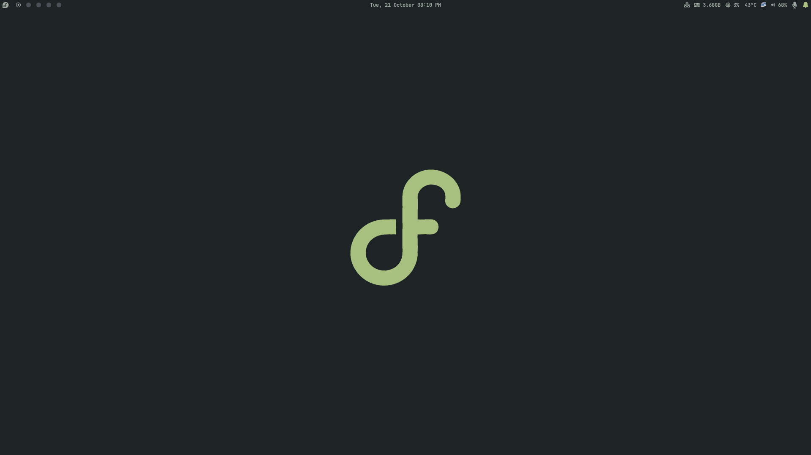
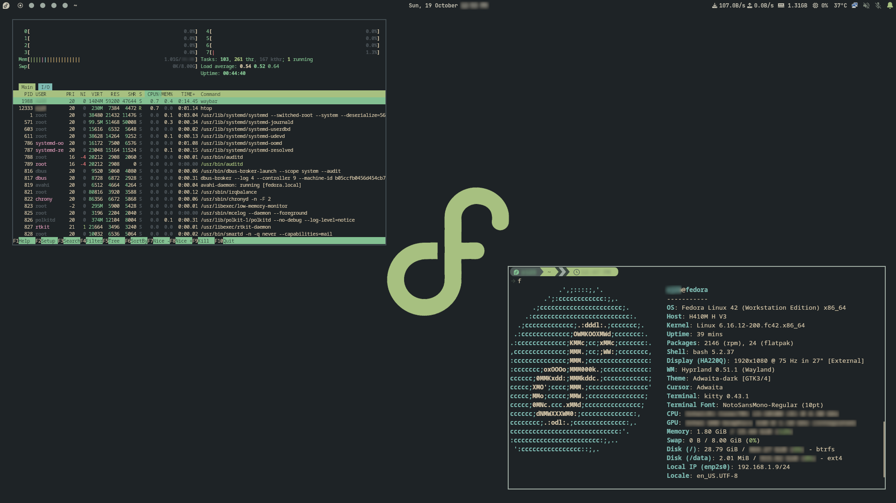
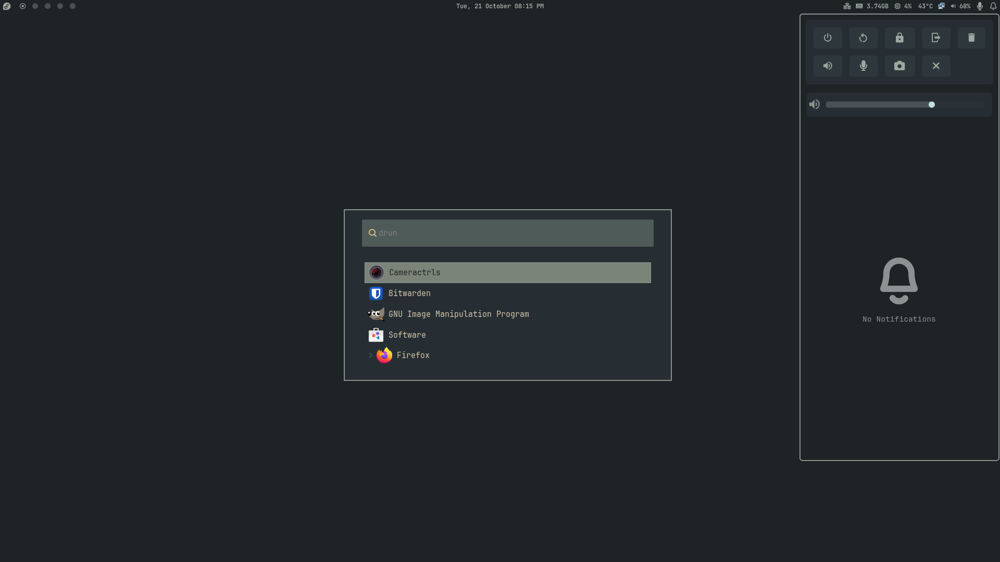

# 🖥️ My Personal Fedora Hyprland Setup

This repository contains my personal **Hyprland** setup on Fedora Gnome base, including configuration files for **SwayNC**, **Waybar**, **Wofi**, and my **shell environment**.  
These configs are tailored for my workflow, visual preferences, and hardware. Configs are optimized for Hyprland + Fedora. Adaptation may be required for other distributions. 

> ⚠️ **Important:** These are for **personal use only**. I do **not** intend to commercialize or distribute them for profit.

---

## Table of Contents

- [Overview](#overview)  
- [Screenshots](#screenshots)
- [Included Configurations](#included-configurations)  
- [Features & Highlights](#features--highlights)  
- [Installation / Usage](#installation--usage)  
- [Fonts & Themes](#fonts--themes)  
- [Inspirations](#inspirations)  
- [License](#license)

---

## Overview

I use this setup daily on Fedora with Hyprland for a **minimal, modern, and efficient workspace**.  
The configurations focus on:

- A visually pleasing **notification center** and control panel.  
- A **status bar** that displays system info, workspaces, and media controls.  
- A **fast and stylish application launcher**.  
- A **custom shell environment** optimized for productivity.

---

## Screenshots

### Hyprland



### Kitty & Htop



### Wofi & Swaync



---

## Included Configurations

### Hyprland
- Wayland tiling window manager.  
- Hyprpaper, hyprlock and hypridle. 

### SwayNC
- Notification center and control panel.  
- Widgets for volume, brightness, workspace management, and system actions.  
- Custom styles using Everforest-inspired colors.

### Waybar
- Status bar setup for Hyprland with modules for:
  - Workspaces
  - Clock
  - Network
  - CPU, memory, temperature
  - PulseAudio (speaker and mic)
  - Notifications
- Highly customizable with CSS and Nerd Fonts icons.

### Wofi
- Application launcher configuration with a modern dark theme.  
- Custom font, scroll, and input styling.  
- Supports images/icons in menu entries.

### Shell (`.bashrc`)
- Custom PATH additions and aliases.  
- Starship prompt integration for a modern terminal.  
- Structured to include modular scripts and aliases from `~/.bashrc.d/`.  

---

## Features & Highlights

- **Custom Color Palette**: Everforest-inspired for all widgets.  
- **JetBrainsMono Nerd Font**: for SwayNC, Waybar, Wofi.
- **Caskadiya Code Nerd Font**: for kitty.  
- **Script Integration**: Custom scripts for screenshots, locking, and notifications.  
- **Flexible Modules**: Easily add/remove modules in Waybar and SwayNC.  
- **Dark & Minimal UI**: Focus on clarity, readability, and minimal distraction.

---

## Installation / Usage

> ⚠️ These files are highly **personalized**. Use at your own risk.

1. Clone the repository:

```
git clone https://github.com/rj23dev/dotfiles.git

```

2. Copy configuration files to their respective locations:

```
cp -r dotfiles/fedora_Dots/.config/hypr ~/.config/hypr
cp -r dotfiles/fedora_Dots/.config/waybar ~/.config/waybar
cp -r dotfiles/fedora_Dots/.config/swaync ~/.config/swaync
cp -r dotfiles/fedora_Dots/.config/wofi ~/.config/wofi
cp -r dotfiles/fedora_Dots/.config/kitty ~/.config/kitty
cp -r dotfiles/fedora_Dots/.config/backgrounds ~/.config/backgrounds
cp -r dotfiles/fedora_Dots/.config/starship.toml ~/.config/starship.toml
cp -r dotfiles/fedora_Dots/.config/gtk-3.0 ~/.config/gtk-3.0
cp -r dotfiles/fedora_Dots/.config/gtk-4.0 ~/.config/gtk-4.0
cp dotfiles/fedora_Dots/.bashrc ~/
cp dotfiles/fedora_Dots/.bash_aliases ~/

```
3. Source the new .bashrc or restart your terminal:

```
source ~/.bashrc
source ~/.bash_aliases

```

## Fonts & Themes

- Font: JetBrainsMono Nerd Font, Caskadiya Code Nerd Font
- Color Theme: Custom Everforest-inspired palette
- Icons: Nerd Fonts (for Waybar, SwayNC, Wofi)

## Inspirations

I have taken **direct inspiration from many publicly available dotfiles and online sources**.  
While the base ideas come from these resources, I have **customized, modified, and tweaked** them to fit my workflow and visual preferences.  

Feel free to **use, adapt, or learn** from these configs, but please **respect the original authors** if referencing their work.

## License

This repository is licensed under the [MIT License](LICENSE).  
You are free to use, modify, and distribute these files for personal use. Commercial use is not intended.
